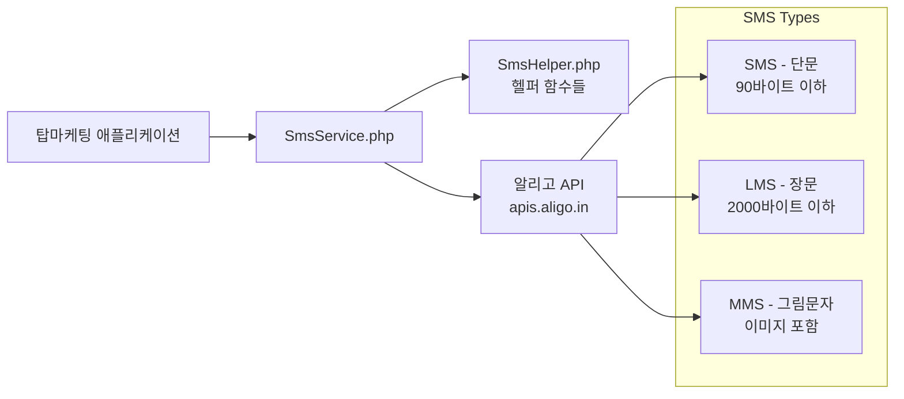

# 탑마케팅 플랫폼 시스템 아키텍처

**최종 수정일:** 2025-06-02 22:40:00 KST

---

## 개요
탑마케팅 플랫폼은 **커뮤니티 중심 서비스**로서, 네트워크 마케팅 리더 및 기업가를 지원하기 위해 사용자 간 정보 교환, 게시판, 댓글, 채팅 기능을 제공합니다. 전체 시스템은 **LAMP 스택**을 기반으로 구축되었으며, 실시간 기능은 **Firebase**를 통해 구현되었습니다.

**🎯 현재 상태 (2025-06-02 22:40):**
- ✅ 핵심 회원가입/로그인 시스템 완전 구동
- ✅ SMS 인증 시스템 실제 운영 중
- ✅ reCAPTCHA v3 보안 시스템 적용
- ✅ 데이터베이스 및 웹서버 안정적 운영

---

## 핵심 기술 스택
- **OS:** CentOS Linux release 7.9.2009 (Core)  
- **웹 서버:** Apache/2.4.6 (CentOS)  
- **서버 사이드:** PHP 8.0.30 (mod_php 또는 PHP-FPM)  
- **데이터베이스:** MariaDB 10.6.5 (`topmkt` 스키마, UTF8mb4)  
- **프론트엔드:** HTML/CSS/JavaScript (ES6 이상)  
- **실시간 서비스:** Firebase Realtime Database / Cloud Firestore, FCM (Firebase Cloud Messaging)  
- **인증:** PHP 세션 기반 (JWT 미사용)  
- **버전 관리:** Git (Gitflow 또는 GitHub flow)  
- **CI/CD:** Git → GitLab CI 또는 GitHub Actions → 자동 테스트/배포

---

## 시스템 구성도

```mermaid
flowchart TD
    subgraph Browser
        A[웹 브라우저 (HTML/CSS/JS)]
    end
    subgraph Server
        B[Apache/2.4.6 + PHP 8.0.30 웹 서버<br>(CentOS 7.9)]
        B --> C[MariaDB 10.6.5<br>(topmkt 스키마)]
        B --> D[Firebase (실시간 기능)]
    end
    A -->|HTTPS| B
```

1. **웹 브라우저(클라이언트):**  
   - HTML/CSS로 UI 구성, JavaScript(ES6)로 동적 기능 구현  
   - AJAX 요청으로 서버와 비동기 통신  
   - Firebase SDK 연동: 실시간 채팅, 알림 수신

2. **웹 서버 (Apache + PHP):**  
   - 정적 자산(CSS, JS, 이미지) 제공  
   - PHP 스크립트(mod_php 또는 PHP-FPM)로 동적 요청 처리  
   - **MVC 패턴** 유사 구조:  
     - **Controller (컨트롤러):** 요청 라우팅, 비즈니스 로직 수행  
     - **Model (모델):** MariaDB 쿼리 / ORM / Prepared Statement  
     - **View (뷰):** PHP 템플릿(헤더, 푸터, 개별 페이지)

3. **데이터베이스 (MariaDB):**  
   - 관계형 데이터 저장 (`users`, `company_profiles`, `posts`, `comments`, `tags`, `notifications`, `sessions`, `audit_logs` 등)  
   - InnoDB 스토리지 엔진, 외래 키(FK) 제약, 인덱스 최적화  
   - 정기 백업(`mysqldump`) 및 파티셔닝(월별) 고려  

4. **Firebase (실시간 기능):**  
   - **Realtime Database / Cloud Firestore:**  
     - 채팅 메시지 실시간 동기화  
     - 알림 데이터 저장 및 브라우저 푸시 실시간 업데이트  
   - **Firebase Cloud Messaging (FCM):**  
     - 브라우저/앱 푸시 알림 전송  
   - **Firebase Auth (선택적):**  
     - 현재는 PHP 세션 인증 사용, Firebase Auth 미사용  
     - 향후 모바일 앱 연동 시 검토 가능  

---

## 프론트엔드 (웹 브라우저)
- **HTML 템플릿 / CSS 스타일시트 / JavaScript**  
- **AJAX 호출:** 페이지 새로고침 없이 서버 데이터 요청 및 업데이트  
- **Firebase SDK:**  
  - `import { getDatabase, ref, onValue, push } from "firebase/database";`  
  - 채팅방/알림 컬렉션을 실시간 구독 및 업데이트  
- **라이브러리:**  
  - Vanilla JS, jQuery(필요 시), Vue.js(필요 시)  
  - Axios 또는 Fetch API 사용 가능  
- **반응형 디자인:** 모바일/태블릿 지원 (Media Query 활용)  

---

## 백엔드 (Apache + PHP)
- **Apache 웹 서버 (2.4.6):**  
  - DocumentRoot: `/var/www/html/topmkt`  
  - SSL 설정: `https://www.topmktx.com` (포트 443)  
  - `SSLCertificateFile` 등 SSL 파일 경로 설정  
- **PHP 8.0.30:**  
  - `session_start()` 기반 세션 관리  
  - `PDO` 또는 `MySQLi` Prepared Statement 사용  
  - `htmlspecialchars`, `filter_var` 등 보안 함수 사용  
- **디렉토리 구조 (참조):** `/var/www/html/topmkt/src/controllers`, `/models`, `/views` 등  
- **MVC 패턴 유사 구조:**  
  - **컨트롤러 (Controllers):** 요청 파라미터 검증 → 모델 호출 → 뷰 렌더링 또는 JSON 응답  
  - **모델 (Models):** DB 쿼리(예: `User::findByEmail($email)`) → 결과 반환  
  - **뷰 (Views):** PHP 템플릿 → HTML 출력, AJAX 요청 시 JSON 반환

---

## 데이터베이스 (MariaDB 10.6.5)
- **스키마:** `topmkt` (UTF8mb4)  
- **테이블:**  
  - `users`, `company_profiles`, `posts`, `comments`, `tags`, `post_tags`,  
  - `notifications`, `sessions`, `audit_logs`  
- **무결성:**  
  - 외래 키(FK) 제약 (ON DELETE CASCADE, ON UPDATE CASCADE)  
  - 인덱스: `user_id`, `post_id`, `created_at`, `expires_at` 등  
- **백업 및 복원:**  
  - **일일 전체 백업:**  
    ```bash
    mysqldump --single-transaction topmkt > /backup/topmkt_YYYYMMDD.sql
    ```  
  - **파티셔닝:** 대용량 테이블(`posts`, `comments`, `audit_logs`) 월별 파티셔닝 권장  
  - **고가용성:** Master-Slave 복제 또는 Galera Cluster (추후 확장 시)  

---

## 실시간 기능 (Firebase)
- **채팅:**  
  - 클라이언트 → Firebase Realtime DB에 메시지 쓰기 → 다른 클라이언트 실시간 구독  
  - 채팅 로그 백업: 서버에서 Firebase Admin SDK로 주기적 백업 가능  
  - 채팅 보안 규칙: 인증된 사용자만 읽기/쓰기 가능하도록 설정  
- **알림:**  
  - 서버 이벤트(댓글, 제재 등) 발생 시 Firebase Admin SDK로 FCM 푸시  
  - 클라이언트: Service Worker 등록하여 브라우저 푸시 표시  
  - 알림 기록: Firebase Realtime DB 또는 MariaDB `notifications` 테이블에 저장  

---

## 인증 및 세션 관리
- **PHP 세션 기반 인증:**  
  - 로그인 성공 시 `session_regenerate_id(true)` → 세션 ID 재발급  
  - 세션 쿠키 속성:  
    ```apache
    <IfModule mod_php7.c>
      php_value session.cookie_secure   1
      php_value session.cookie_httponly 1
      php_value session.cookie_samesite Strict
    </IfModule>
    ```  
  - 세션 저장소: 기본 파일 기반, 향후 Redis 활용 가능  
  - **세션 만료 정책:** 30분 미활동 자동 만료 (`session.gc_maxlifetime = 1800`)  

- **소셜 로그인 미사용:**  
  - 페이스북/구글 OAuth 연동 계획 없음  
  - 모든 사용자 계정은 자체 DB(MariaDB)에서 관리  

---

## 보안 고려사항
- **웹 보안 (프론트엔드):**  
  - 모든 요청 HTTPS 통신 강제 (포트 80 → 443 리다이렉트)  
  - 사용자 입력 폼에 클라이언트 측 유효성 검사 + 서버 측 검증  
  - CSP 헤더:  
    ```http
    Content-Security-Policy: default-src 'self'; script-src 'self';
    ```

- **서버 보안 (백엔드):**  
  - Prepared Statement 사용 → SQL 인젝션 방지  
  - `htmlspecialchars` → XSS 방지  
  - CSRF 토큰:  
    ```html
    <input type="hidden" name="csrf_token" value="<?= $_SESSION['csrf_token'] ?>">
    ```  
  - Apache `.htaccess` 또는 `VirtualHost` 설정으로 디렉토리 접근 제어  
    ```apache
    <Directory "/var/www/html/topmkt/uploads">
      Options -Indexes
      AllowOverride None
      Require all granted
    </Directory>
    ```  
  - PHP 보안 설정: `display_errors = Off`, 오류는 `error_log`에만 기록  

- **인증 및 세션 보안:**  
  - 세션 ID 탈취 방지: HttpOnly, Secure, SameSite  
  - 세션 고정 방지: 로그인 시 `session_regenerate_id(true)`  
  - 비밀번호:  
    ```php
    password_hash($password, PASSWORD_BCRYPT);
    password_verify($input, $hashed);
    ```  
  - 로그인 실패 제한: 5회 이상 실패 시 CAPTCHA 적용 또는 계정 잠금  

- **Firebase 보안:**  
  - Firebase Realtime DB Security Rules 설정  
    ```json
    {
      "rules": {
        "chats": {
          "$room": {
            ".read": "auth != null && root.child('chatRooms').child($room).child('members').child(auth.uid).exists()",
            ".write": "auth != null && root.child('chatRooms').child($room).child('members').child(auth.uid).exists()"
          }
        }
      }
    }
    ```

## SMS 서비스 아키텍처

### SMS 발송 시스템 구성
- **SMS 서비스 제공업체:** 알리고 (smartsms.aligo.in)
- **API 연동 방식:** REST API (HTTPS)
- **인증:** API 키 + 사용자 ID
- **발신번호:** 070-4136-8899 (등록 및 승인 완료)

### SMS 서비스 구조


### SMS 서비스 클래스 및 기능
- **SmsService 클래스:**
  - 알리고 API 직접 연동
  - 발송 결과 처리 및 에러 핸들링
  - 전화번호 포맷팅 및 유효성 검사
  - 메시지 타입 자동 판별 (SMS/LMS)

- **SmsHelper 헬퍼 함수:**
  - `sendSms()`: 기본 SMS 발송
  - `sendAuthCodeSms()`: 인증번호 발송
  - `sendWelcomeSms()`: 환영 메시지
  - `sendNotificationSms()`: 중요 알림
  - `sendBulkSms()`: 대량 발송
  - `createSmsTemplate()`: 템플릿 기반 메시지 생성

### SMS 보안 및 정책
- **발송 제한 사항:**
  - 발송 시간: 오전 8시 ~ 오후 9시
  - 광고성 메시지: [광고] 표기 의무
  - 수신 동의 확인 필수
  - 스팸 방지: 동일 번호 연속 발송 제한

- **비용 관리:**
  - SMS (단문): 건당 약 20원
  - LMS (장문): 건당 약 50원  
  - MMS (그림문자): 건당 약 200원
  - 잔여 건수 실시간 모니터링

### SMS 활용 시나리오
1. **사용자 인증:** 회원가입, 로그인 시 인증번호 발송
2. **비밀번호 재설정:** 임시 비밀번호 SMS 발송
3. **중요 알림:** 시스템 점검, 정책 변경 등
4. **마케팅:** 이벤트, 프로모션 정보 (수신 동의자만)
5. **거래 확인:** 결제 완료, 주문 접수 등
