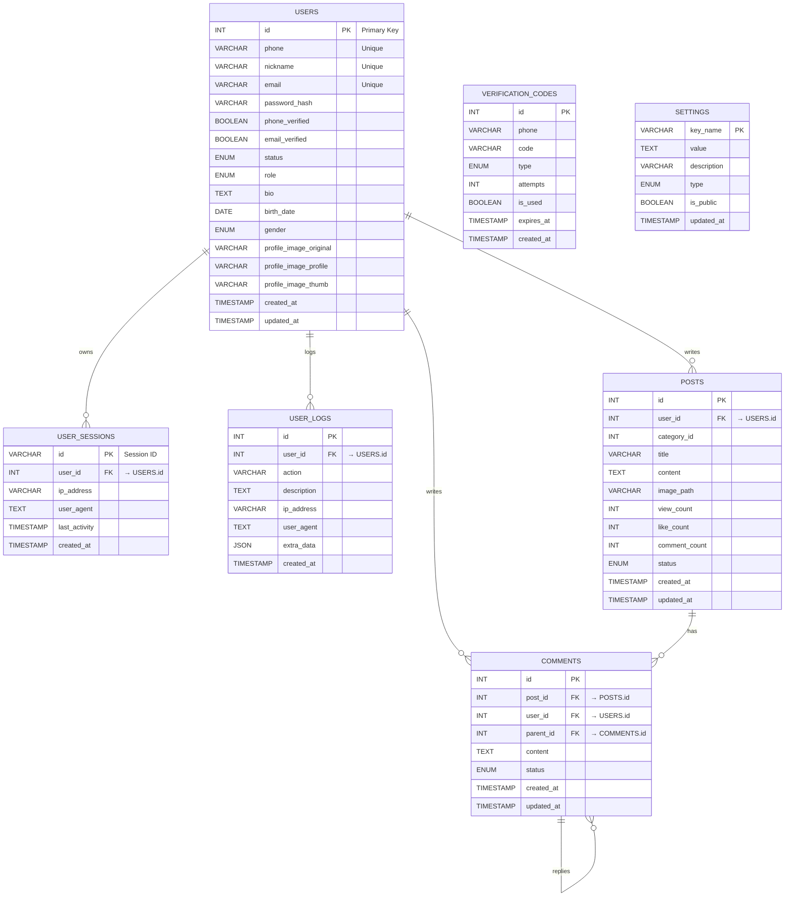

# 탑마케팅 플랫폼 DB 구조

**최종 수정일:** 2025-07-09 KST  
**상태:** 실제 구현된 테이블 구조 완료 + 카카오 주소 검색 API 연동 위경도 필드 추가 + 이벤트 마감일 시스템 + UTF-8mb4 인코딩 완료

---

커뮤니티 기반 플랫폼의 주요 데이터 모델을 정의합니다. 모든 테이블은 MariaDB InnoDB 스토리지 엔진을 사용하며, 외래 키 제약과 인덱스를 통해 데이터 무결성 및 조회 성능을 보장합니다.

**🎯 현재 구현 상태:** 회원가입/로그인/커뮤니티 게시판 시스템 완전 구동

## ER 다이어그램



## 📋 실제 구현된 테이블 정의

### 1. users (회원 정보)
- **설명:** 사용자 계정 정보, 인증 상태, 권한 관리를 위한 테이블
- **주요 컬럼:**
  - `id` INT AUTO_INCREMENT PRIMARY KEY
  - `nickname` VARCHAR(50) NOT NULL UNIQUE (닉네임)
  - `phone` VARCHAR(20) NOT NULL UNIQUE (휴대폰 번호)
  - `email` VARCHAR(100) NOT NULL UNIQUE (이메일)
  - `bio` TEXT NULL (자기소개)
  - `birth_date` DATE NULL (생년월일)
  - `gender` ENUM('M','F','OTHER') NULL (성별)
  - `profile_image_original` VARCHAR(255) NULL (원본 프로필 이미지)
  - `profile_image_profile` VARCHAR(255) NULL (프로필용 이미지)
  - `profile_image_thumb` VARCHAR(255) NULL (썸네일 이미지)
  - `website_url` VARCHAR(255) NULL (웹사이트 URL)
  - `social_links` LONGTEXT NULL (소셜 링크 JSON)
  - `profile_image` VARCHAR(255) NULL (레거시 프로필 이미지)
  - `password_hash` VARCHAR(255) NOT NULL (암호화된 비밀번호)
  - `marketing_agreed` BOOLEAN DEFAULT 0 (마케팅 정보 수신 동의)
  - `phone_verified` BOOLEAN DEFAULT 0 (휴대폰 인증 여부)
  - `email_verified` BOOLEAN DEFAULT 0 (이메일 인증 여부)
  - `login_attempts` INT DEFAULT 0 (로그인 실패 횟수)
  - `locked_until` TIMESTAMP NULL (계정 잠금 해제 시간)
  - `last_login` TIMESTAMP NULL (마지막 로그인 시간)
  - `remember_token` VARCHAR(64) NULL (자동 로그인 토큰)
  - `remember_expires` DATETIME NULL (자동 로그인 토큰 만료일)
  - `status` ENUM('active','inactive','suspended','deleted') DEFAULT 'active' (계정 상태)
  - `role` ENUM('ROLE_USER', 'ROLE_CORP', 'ROLE_ADMIN') DEFAULT 'ROLE_USER' (사용자 역할)
  - `extra_data` LONGTEXT NULL (확장 데이터 JSON)
  - `created_at` TIMESTAMP DEFAULT CURRENT_TIMESTAMP
  - `updated_at` TIMESTAMP DEFAULT CURRENT_TIMESTAMP ON UPDATE CURRENT_TIMESTAMP

**회원 역할 (role) 정의:**
- `ROLE_USER`: 일반회원 - 커뮤니티 기본 기능 사용
- `ROLE_CORP`: 기업회원 - 회사 소개, 행사/강의 등록 권한 (미구현)
- `ROLE_ADMIN`: 관리자 - 전체 시스템 관리 권한

### 2. user_sessions (회원 세션 관리)
- **설명:** 사용자 세션 관리 및 보안을 위한 테이블
- **주요 컬럼:**
  - `id` VARCHAR(128) PRIMARY KEY (세션 ID)
  - `user_id` INT NOT NULL (사용자 ID)
  - `ip_address` VARCHAR(45) NOT NULL (IP 주소)
  - `user_agent` TEXT NULL (User Agent)
  - `last_activity` TIMESTAMP DEFAULT CURRENT_TIMESTAMP ON UPDATE CURRENT_TIMESTAMP
  - `created_at` TIMESTAMP DEFAULT CURRENT_TIMESTAMP
- **제약 및 인덱스:**
  - FOREIGN KEY (`user_id`) REFERENCES `users`(`id`) ON DELETE CASCADE
  - INDEX (`user_id`), INDEX (`last_activity`)

### 3. user_logs (사용자 활동 로그)
- **설명:** 사용자 활동 및 시스템 이벤트 기록을 위한 테이블
- **주요 컬럼:**
  - `id` INT AUTO_INCREMENT PRIMARY KEY
  - `user_id` INT NULL (사용자 ID, 비회원 활동도 기록)
  - `action` VARCHAR(50) NOT NULL (활동 유형: LOGIN, LOGOUT, SIGNUP 등)
  - `description` TEXT NULL (상세 설명)
  - `ip_address` VARCHAR(45) NOT NULL (IP 주소)
  - `user_agent` TEXT NULL (User Agent)
  - `extra_data` JSON NULL (추가 데이터)
  - `created_at` TIMESTAMP DEFAULT CURRENT_TIMESTAMP
- **제약 및 인덱스:**
  - FOREIGN KEY (`user_id`) REFERENCES `users`(`id`) ON DELETE SET NULL
  - INDEX (`user_id`), INDEX (`action`), INDEX (`created_at`)

### 4. verification_codes (인증번호 임시 저장)
- **설명:** SMS 인증번호 임시 저장 및 관리를 위한 테이블
- **주요 컬럼:**
  - `id` INT AUTO_INCREMENT PRIMARY KEY
  - `phone` VARCHAR(13) NOT NULL (휴대폰 번호)
  - `code` VARCHAR(6) NOT NULL (인증번호)
  - `type` ENUM('SIGNUP', 'LOGIN', 'PASSWORD_RESET') NOT NULL (인증 유형)
  - `attempts` INT DEFAULT 0 (시도 횟수)
  - `is_used` BOOLEAN DEFAULT FALSE (사용 여부)
  - `expires_at` TIMESTAMP NOT NULL (만료 시간)
  - `created_at` TIMESTAMP DEFAULT CURRENT_TIMESTAMP
- **제약 및 인덱스:**
  - INDEX (`phone`), INDEX (`code`), INDEX (`expires_at`)

### 5. posts (커뮤니티 게시글)
- **설명:** 커뮤니티 게시글 정보 및 통계를 관리하는 테이블
- **주요 컬럼:**
  - `id` INT AUTO_INCREMENT PRIMARY KEY
  - `user_id` INT NOT NULL (작성자 ID)
  - `category_id` INT NULL (카테고리 ID, 향후 확장용)
  - `title` VARCHAR(200) NOT NULL (제목)
  - `content` TEXT NOT NULL (내용)
  - `image_path` VARCHAR(255) NULL (첨부 이미지 경로)
  - `view_count` INT DEFAULT 0 (조회수)
  - `like_count` INT DEFAULT 0 (좋아요 수)
  - `comment_count` INT DEFAULT 0 (댓글 수)
  - `status` ENUM('published','draft','deleted') DEFAULT 'published' (게시글 상태)
  - `created_at` TIMESTAMP DEFAULT CURRENT_TIMESTAMP
  - `updated_at` TIMESTAMP DEFAULT CURRENT_TIMESTAMP ON UPDATE CURRENT_TIMESTAMP
- **제약 및 인덱스:**
  - FOREIGN KEY (`user_id`) REFERENCES `users`(`id`) ON DELETE CASCADE
  - INDEX (`user_id`), INDEX (`category_id`), INDEX (`created_at`), INDEX (`status`)
  - INDEX `idx_posts_list_performance` (`status`, `created_at` DESC) (목록 조회 성능 최적화)

### 6. comments (댓글)
- **설명:** 댓글 및 대댓글 정보 관리 테이블
- **주요 컬럼:**
  - `id` INT AUTO_INCREMENT PRIMARY KEY
  - `post_id` INT NOT NULL (게시글 ID)
  - `user_id` INT NOT NULL (작성자 ID)
  - `parent_id` INT NULL (부모 댓글 ID, 대댓글용)
  - `content` TEXT NOT NULL (댓글 내용)
  - `status` ENUM('active','deleted') DEFAULT 'active' (댓글 상태)
  - `created_at` TIMESTAMP DEFAULT CURRENT_TIMESTAMP
  - `updated_at` TIMESTAMP DEFAULT CURRENT_TIMESTAMP ON UPDATE CURRENT_TIMESTAMP
- **제약 및 인덱스:**
  - FOREIGN KEY (`post_id`) REFERENCES `posts`(`id`) ON DELETE CASCADE
  - FOREIGN KEY (`user_id`) REFERENCES `users`(`id`) ON DELETE CASCADE
  - FOREIGN KEY (`parent_id`) REFERENCES `comments`(`id`) ON DELETE CASCADE
  - INDEX (`post_id`), INDEX (`user_id`), INDEX (`parent_id`), INDEX (`status`)

### 7. lectures (강의/이벤트 정보) ✅ 구현 완료
- **설명:** 강의 일정 및 이벤트 정보 관리를 위한 테이블 (완전 구현)
- **주요 컬럼:**
  - `id` INT AUTO_INCREMENT PRIMARY KEY
  - `user_id` INT NOT NULL (등록자 ID)
  - `title` VARCHAR(200) NOT NULL (강의 제목)
  - `description` TEXT NOT NULL (강의 설명)
  - `instructor_name` VARCHAR(100) NOT NULL (강사명)
  - `instructor_info` TEXT NULL (강사 정보)
  - `start_date` DATE NOT NULL (시작일)
  - `end_date` DATE NOT NULL (종료일)
  - `start_time` TIME NOT NULL (시작시간)
  - `end_time` TIME NOT NULL (종료시간)
  - `timezone` VARCHAR(50) DEFAULT 'Asia/Seoul' (시간대)
  - `location_type` ENUM('online','offline','hybrid') DEFAULT 'offline' (진행 방식)
  - `venue_name` VARCHAR(200) NULL (장소명)
  - `venue_address` TEXT NULL (장소 주소)
  - `venue_latitude` DECIMAL(10,8) NULL (위도) **🆕 2025-06-19 추가**
  - `venue_longitude` DECIMAL(11,8) NULL (경도) **🆕 2025-06-19 추가**
  - `online_link` VARCHAR(500) NULL (온라인 링크)
  - `max_participants` INT NULL (최대 참가자 수)
  - `registration_fee` INT DEFAULT 0 (참가비)
  - `registration_deadline` DATETIME NULL (등록 마감일) **🆕 2025-07-09 시스템 구현 완료**
  - `category` ENUM('seminar','workshop','conference','webinar','training') DEFAULT 'seminar'
  - `content_type` ENUM('lecture','event') DEFAULT 'lecture' (강의/행사 구분)
  - `event_scale` ENUM('small','medium','large') NULL (행사 규모)
  - `has_networking` BOOLEAN DEFAULT FALSE (네트워킹 여부)
  - `sponsor_info` TEXT NULL (협찬사 정보)
  - `dress_code` ENUM('casual','business_casual','business','formal') NULL
  - `parking_info` TEXT NULL (주차 정보)
  - `difficulty_level` ENUM('beginner','intermediate','advanced','all') DEFAULT 'all'
  - `tags` JSON NULL (태그 정보)
  - `banner_image` VARCHAR(500) NULL (배너 이미지)
  - `attachments` JSON NULL (첨부파일)
  - `requirements` TEXT NULL (참가 요건)
  - `benefits` TEXT NULL (혜택 정보)
  - `status` ENUM('draft','published','cancelled','completed') DEFAULT 'draft'
  - `is_featured` BOOLEAN DEFAULT FALSE (추천 강의 여부)
  - `view_count` INT DEFAULT 0 (조회수)
  - `registration_count` INT DEFAULT 0 (등록자 수)
  - `youtube_video` VARCHAR(500) NULL (유튜브 영상) **🆕 2025-07-09 검증 강화**
  - `instructor_image` VARCHAR(500) NULL (강사 이미지) **🔄 2025-07-09 다중 등록 개선**
  - `instructors_json` TEXT NULL (강사 정보 JSON) **🔄 2025-07-09 다중 등록 시스템 완성**
  - `lecture_images` TEXT NULL (강의 이미지 JSON)
  - `created_at` TIMESTAMP DEFAULT CURRENT_TIMESTAMP
  - `updated_at` TIMESTAMP DEFAULT CURRENT_TIMESTAMP ON UPDATE CURRENT_TIMESTAMP
- **제약 및 인덱스:**
  - FOREIGN KEY (`user_id`) REFERENCES `users`(`id`) ON DELETE CASCADE
  - INDEX (`user_id`), INDEX (`start_date`), INDEX (`category`), INDEX (`content_type`)
  - INDEX (`status`), INDEX (`is_featured`)


### 8. settings (시스템 설정)
- **설명:** 시스템 전역 설정 관리를 위한 테이블
- **주요 컬럼:**
  - `key_name` VARCHAR(100) PRIMARY KEY (설정 키)
  - `value` TEXT NULL (설정 값)
  - `description` VARCHAR(255) NULL (설정 설명)
  - `type` ENUM('STRING', 'INTEGER', 'BOOLEAN', 'JSON') DEFAULT 'STRING' (값 타입)
  - `is_public` BOOLEAN DEFAULT FALSE (공개 설정 여부)
  - `updated_at` TIMESTAMP DEFAULT CURRENT_TIMESTAMP ON UPDATE CURRENT_TIMESTAMP

---

## 🔮 향후 확장 계획 (미구현 테이블)

### lecture_registrations (강의 신청 관리)
- **설명:** 강의 참가 신청 관리 테이블 (향후 구현 예정)
- **예정 컬럼:**
  - `id` INT AUTO_INCREMENT PRIMARY KEY
  - `lecture_id` INT NOT NULL (lectures.id 참조)
  - `user_id` INT NOT NULL (users.id 참조)
  - `participant_name` VARCHAR(100) NOT NULL
  - `participant_email` VARCHAR(100) NOT NULL
  - `participant_phone` VARCHAR(20) NOT NULL
  - `status` ENUM('pending','confirmed','cancelled') DEFAULT 'pending'
  - `payment_status` ENUM('unpaid','paid','refunded') DEFAULT 'unpaid'
  - `registration_date` TIMESTAMP DEFAULT CURRENT_TIMESTAMP

### 1. company_profiles (기업회원 정보)
- **설명:** 기업회원 세부 정보 관리 테이블 (2차 개발 예정)
- **예정 컬럼:**
  - `company_id` INT PRIMARY KEY
  - `user_id` INT NOT NULL (users.id 참조)
  - `company_name` VARCHAR(255) NOT NULL
  - `business_registration` VARCHAR(100) NOT NULL
  - `approved_at` TIMESTAMP NULL
  - `created_at` TIMESTAMP DEFAULT CURRENT_TIMESTAMP

### 2. tags (태그 시스템)
- **설명:** 게시글 태그 관리 테이블 (향후 구현 예정)
- **예정 컬럼:**
  - `tag_id` INT AUTO_INCREMENT PRIMARY KEY
  - `name` VARCHAR(50) NOT NULL UNIQUE

### 3. post_tags (게시글-태그 매핑)
- **설명:** 게시글과 태그의 다대다 관계 테이블
- **예정 컬럼:**
  - `post_id` INT NOT NULL
  - `tag_id` INT NOT NULL
  - PRIMARY KEY (`post_id`, `tag_id`)

### 4. notifications (알림 시스템)
- **설명:** 실시간 알림 정보 저장 테이블 (향후 구현 예정)
- **예정 컬럼:**
  - `notification_id` INT AUTO_INCREMENT PRIMARY KEY
  - `user_id` INT NOT NULL
  - `type` VARCHAR(50) NOT NULL
  - `reference_id` INT NULL
  - `message` VARCHAR(255) NOT NULL
  - `is_read` BOOLEAN DEFAULT FALSE
  - `created_at` TIMESTAMP DEFAULT CURRENT_TIMESTAMP

---

## 📊 관계 및 인덱스 전략

### 외래 키 제약 설정
- **사용자 관련:** `user_sessions.user_id`, `user_logs.user_id`, `posts.user_id`, `comments.user_id`
- **게시글 관련:** `comments.post_id`, `comments.parent_id` (대댓글)
- **CASCADE 정책:** 사용자 삭제 시 관련 데이터 자동 삭제 (user_sessions, posts, comments)
- **SET NULL 정책:** 로그 데이터는 사용자 삭제 후에도 유지 (user_logs.user_id)

### 성능 최적화 인덱스
- **사용자 테이블:** `phone`, `email`, `nickname`, `status`, `created_at`
- **세션 테이블:** `user_id`, `last_activity`
- **로그 테이블:** `user_id`, `action`, `created_at`
- **인증번호 테이블:** `phone`, `code`, `expires_at`
- **게시글 테이블:** `user_id`, `category_id`, `created_at`
- **댓글 테이블:** `post_id`, `user_id`, `parent_id`

### 데이터베이스 설정
- **엔진:** InnoDB (트랜잭션, 외래키 지원)
- **문자셋:** UTF8mb4 (이모지 지원)
- **콜레이션:** utf8mb4_unicode_ci (한글 정렬 지원)

### 확장성 고려사항
- **파티셔닝:** `user_logs` 테이블 월별 파티셔닝 검토 (대용량 로그 데이터)
- **읽기 전용 복제본:** 조회 성능 향상을 위한 Master-Slave 구성 검토
- **캐싱:** Redis를 활용한 세션 및 자주 조회되는 데이터 캐싱

---

## 📝 실제 구현된 DDL 예시

```sql
-- 회원 테이블 (실제 구현된 구조)
CREATE TABLE users (
    id INT AUTO_INCREMENT PRIMARY KEY,
    nickname VARCHAR(50) NOT NULL UNIQUE,
    phone VARCHAR(20) NOT NULL UNIQUE,
    email VARCHAR(100) NOT NULL UNIQUE,
    bio TEXT NULL,
    birth_date DATE NULL,
    gender ENUM('M','F','OTHER') NULL,
    profile_image_original VARCHAR(255) NULL,
    profile_image_profile VARCHAR(255) NULL,
    profile_image_thumb VARCHAR(255) NULL,
    website_url VARCHAR(255) NULL,
    social_links LONGTEXT NULL,
    password_hash VARCHAR(255) NOT NULL,
    marketing_agreed BOOLEAN DEFAULT 0,
    phone_verified BOOLEAN DEFAULT 0,
    email_verified BOOLEAN DEFAULT 0,
    login_attempts INT DEFAULT 0,
    locked_until TIMESTAMP NULL,
    last_login TIMESTAMP NULL,
    remember_token VARCHAR(64) NULL,
    remember_expires DATETIME NULL,
    status ENUM('active','inactive','suspended','deleted') DEFAULT 'active',
    role ENUM('ROLE_USER', 'ROLE_CORP', 'ROLE_ADMIN') DEFAULT 'ROLE_USER',
    extra_data LONGTEXT NULL,
    created_at TIMESTAMP DEFAULT CURRENT_TIMESTAMP,
    updated_at TIMESTAMP DEFAULT CURRENT_TIMESTAMP ON UPDATE CURRENT_TIMESTAMP
) ENGINE=InnoDB DEFAULT CHARSET=utf8mb4 COLLATE=utf8mb4_unicode_ci;

-- 커뮤니티 게시글 테이블 (실제 구현된 구조)
CREATE TABLE posts (
    id INT AUTO_INCREMENT PRIMARY KEY,
    user_id INT NOT NULL,
    category_id INT NULL,
    title VARCHAR(200) NOT NULL,
    content TEXT NOT NULL,
    image_path VARCHAR(255) NULL,
    view_count INT DEFAULT 0,
    like_count INT DEFAULT 0,
    comment_count INT DEFAULT 0,
    status ENUM('published','draft','deleted') DEFAULT 'published',
    created_at TIMESTAMP DEFAULT CURRENT_TIMESTAMP,
    updated_at TIMESTAMP DEFAULT CURRENT_TIMESTAMP ON UPDATE CURRENT_TIMESTAMP,
    FOREIGN KEY (user_id) REFERENCES users(id) ON DELETE CASCADE,
    INDEX idx_posts_list_performance (status, created_at DESC)
) ENGINE=InnoDB DEFAULT CHARSET=utf8mb4 COLLATE=utf8mb4_unicode_ci;

-- 댓글 테이블 (실제 구현된 구조)
CREATE TABLE comments (
    id INT AUTO_INCREMENT PRIMARY KEY,
    post_id INT NOT NULL,
    user_id INT NOT NULL,
    parent_id INT NULL,
    content TEXT NOT NULL,
    status ENUM('active','deleted') DEFAULT 'active',
    created_at TIMESTAMP DEFAULT CURRENT_TIMESTAMP,
    updated_at TIMESTAMP DEFAULT CURRENT_TIMESTAMP ON UPDATE CURRENT_TIMESTAMP,
    FOREIGN KEY (post_id) REFERENCES posts(id) ON DELETE CASCADE,
    FOREIGN KEY (user_id) REFERENCES users(id) ON DELETE CASCADE,
    FOREIGN KEY (parent_id) REFERENCES comments(id) ON DELETE CASCADE
) ENGINE=InnoDB DEFAULT CHARSET=utf8mb4 COLLATE=utf8mb4_unicode_ci;
```

---

## 🎯 현재 구현 상태 요약

### ✅ 완전 구현된 기능
- **사용자 관리:** 회원가입, 로그인, 세션 관리, 프로필 관리
- **보안 인증:** SMS 인증, 이메일 인증, 자동 로그인(Remember Me)
- **커뮤니티:** 게시글 CRUD, 페이지네이션, 검색, 이미지 업로드
- **댓글 시스템:** 댓글 작성/수정/삭제, 대댓글, 페이지네이션
- **로깅:** 사용자 활동 추적, 보안 이벤트 기록
- **실시간 채팅 시스템:** Firebase Realtime Database 기반 채팅 시스템 완전 구현
- **강의/이벤트 시스템:** lectures 테이블 기반 완전 구현 (2025-07-09 완료)
- **이벤트 마감일 시스템:** 등록 마감일 설정 및 자동 차단 기능 (2025-07-09 완료)
- **강사 다중 등록:** 복수 강사 정보 저장 및 이미지 업로드 (2025-07-09 완료)

### 🔄 현재 미구현 (컨트롤러만 존재)
- **좋아요 기능:** 테이블 스키마는 있으나 기능 미구현

### 🔄 다음 구현 예정
- **좋아요 기능:** 게시글/댓글 추천 시스템 완성
- **알림 시스템:** 실시간 알림, FCM 연동
- **태그 시스템:** 게시글 분류 및 검색 최적화

---

## 🌐 데이터베이스 문자셋 설정 (2025-07-09 완료)

### UTF-8mb4 인코딩 완전 구현

**구현 배경:**
- 한국어 제목/내용 깨짐 현상 완전 해결
- 이모지 및 특수 문자 완전 지원
- 글로벌 다국어 지원 기반 마련

**데이터베이스 전역 설정:**
```sql
-- 데이터베이스 문자셋 설정
ALTER DATABASE topmkt CHARACTER SET utf8mb4 COLLATE utf8mb4_unicode_ci;

-- 연결 시 문자셋 강제 설정
SET NAMES utf8mb4 COLLATE utf8mb4_unicode_ci;
SET character_set_client = utf8mb4;
SET character_set_connection = utf8mb4;
SET character_set_results = utf8mb4;
SET character_set_database = utf8mb4;
SET character_set_server = utf8mb4;
```

**테이블 문자셋 설정:**
- 모든 테이블: `DEFAULT CHARSET=utf8mb4 COLLATE=utf8mb4_unicode_ci`
- VARCHAR, TEXT, JSON 필드: 완전한 한국어 지원
- 이모지 및 특수 문자: 완전한 저장 및 표시 지원

**적용 범위:**
- ✅ `users` 테이블: 닉네임, 이메일, 프로필 정보
- ✅ `posts` 테이블: 게시글 제목, 내용
- ✅ `comments` 테이블: 댓글 내용
- ✅ `lectures` 테이블: 강의 제목, 설명, 강사 정보
- ✅ 모든 TEXT, VARCHAR 필드: 한국어 완전 지원

**검증 결과:**
- **이전**: "QA 테스트 행사" (깨진 문자)
- **현재**: "QA 테스트 행사" (정상 표시)
- **성능**: 인코딩 변경 후 성능 저하 없음 확인
